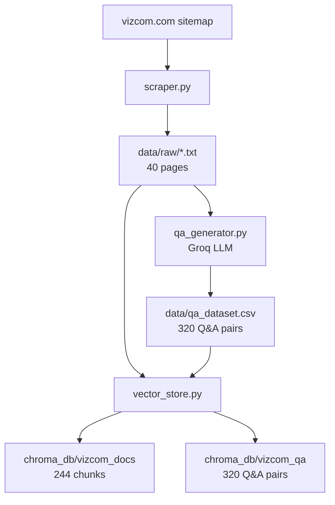
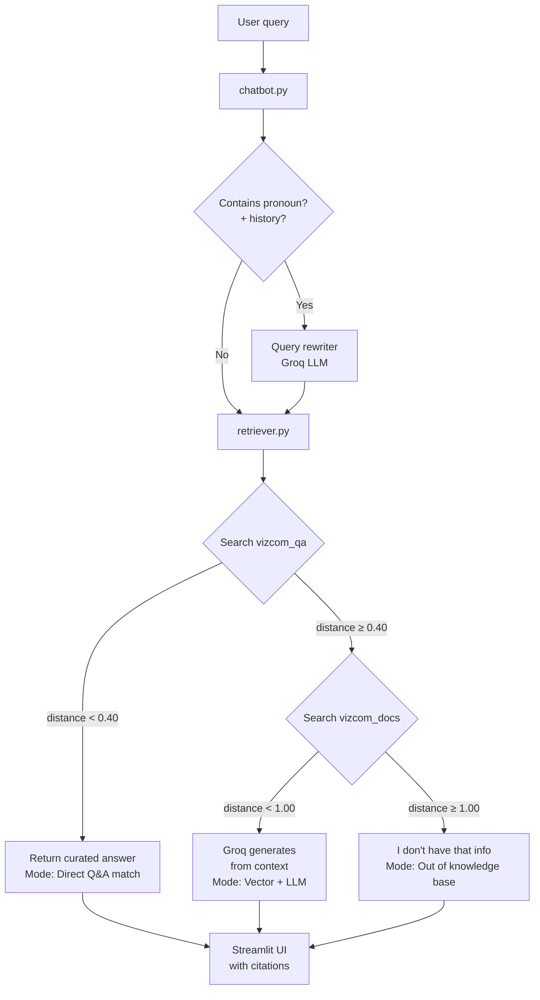

# Vizcom RAG Chatbot

A document-grounded chatbot built on [vizcom.com](https://vizcom.com) content using
synthetic Q&A generation and hybrid retrieval over a Chroma vector store.

Built as the final assignment for the AGAI-03 cohort by Janda van Dyk.

---

## What it does

The chatbot answers natural-language questions about Vizcom — products, pricing,
solutions, careers, security, design workflows — using a two-stage hybrid
retrieval architecture:

1. **Q&A semantic search.** The user's question is matched against a curated
   dataset of 320 synthetic Q&A pairs generated from the scraped content. If
   the top match is sufficiently close (cosine distance < 0.40), the curated
   answer is returned directly.
2. **Vector fallback.** Otherwise the question is matched against chunks of
   the raw scraped pages, and Llama 3.3 70B generates an answer using the
   retrieved context.
3. **Graceful decline.** If even vector search produces a weak match
   (distance > 1.00), the chatbot politely declines rather than hallucinating.

A small LLM-based query rewriter resolves pronouns ("it", "that") against
recent conversation history before retrieval, so multi-turn conversations
work correctly.

---

## Tech stack

| Component             | Choice                                        |
| --------------------- | --------------------------------------------- |
| Language              | Python 3.14                                   |
| Web scraping          | requests + BeautifulSoup4 + lxml              |
| LLM provider          | [Groq](https://groq.com) (free tier)          |
| LLM model             | Llama 3.3 70B Versatile                       |
| Embeddings            | sentence-transformers / all-MiniLM-L6-v2      |
| Vector database       | Chroma (persistent local)                     |
| Chunking              | LangChain RecursiveCharacterTextSplitter      |
| UI                    | Streamlit                                     |
| Secrets               | python-dotenv                                 |

---

## Pipeline overview
The system runs in two phases — offline data preparation and online query handling.

### Offline (one-time, run from terminal)

### Online (each user query)

